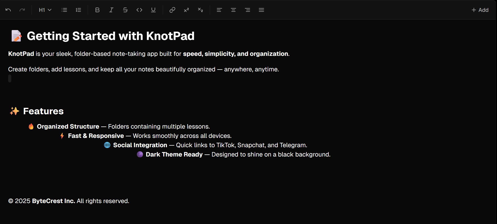

# KnotPad

Organize your ideas, capture your thoughts, and structure your notes exactly how your mind works — all in one clean, powerful workspace. KnotPad is a structured note‑taking app built with Next.js and React. It features notebooks/folders, a modern rich text editor, authentication, dark mode, and a focus on performance.

## Features
- Structured notebooks and notes to keep everything organized
- Rich text editor powered by TipTap (formatting, links, underline, align, sub/superscript, etc.)
- Authentication with email/password and Google (BetterAuth)
- Email verification and password reset via Resend
- PostgresSQL database with Drizzle ORM
- Responsive UI, dark mode support, and polished UX animations
- Performance‑minded setup (see Performance Audit below)

## Tech Stack
- Next.js 15 (App Router) and React 19
- TypeScript, Tailwind CSS
- Drizzle ORM + PostgresSQL (Neon or any Postgres)
- BetterAuth (+ Google OAuth) and Resend for transactional emails
- Framer Motion / Motion for animations

## Prerequisites
- Node.js 18.18+ (or 20+ recommended)
- Package manager: pnpm (Corepack-enabled)
  - If needed: corepack enable && pnpm -v
- A PostgresSQL database (e.g., Neon, Sup abase, local Postgres)
- Resend account for emails (verification/reset)
- Google OAuth credentials (optional but supported)

## Quick Start
1. Install dependencies
   - pnpm install
2. Configure environment variables (create .env at project root)
   - DATABASE_URL=postgres://<user>:<password>@<host>:<port>/<db>
   - RESEND_API_KEY=your_resend_api_key
   - GOOGLE_CLIENT_ID=your_google_oauth_client_id
   - GOOGLE_CLIENT_SECRET=your_google_oauth_client_secret
   - NEXT_PUBLIC_BASE_URL=http://localhost:3000  (optional; used for API path building)
3. Prepare the database schema (Drizzle)
   - pnpm dlx drizzle-kit generate
   - pnpm dlx drizzle-kit push
4. Run the development server
   - pnpm dev
5. Open http://localhost:3000 in your browser

Notes
- The app uses a dark and light screenshot in the UI; the README showcases public/app-screen-dark.png.
- Outgoing emails are sent via Resend. Ensure the sending domain/address in code (lib/auth.ts) is configured for your account.

## Available Scripts
- dev: next dev --turbo pack
- build: next build
- start: next start
- lint: next lint

## Environment Variables Summary
- DATABASE_URL: Postgres connection string used by Drizzle
- RESEND_API_KEY: API key for Resend to send verification and reset emails
- GOOGLE_CLIENT_ID / GOOGLE_CLIENT_SECRET: for Google login with BetterAuth
- NEXT_PUBLIC_BASE_URL: optional; overrides base URL when building API paths in the client

## Performance Audit and Optimization
See PERFORMANCE_AUDIT.md for the plan, target metrics (RESTFB, FCP, LCP, CLS, INP), and concrete optimizations in this repo (lazy-loaded editor, caching headers, next/font usage), plus recommended tools (Lighthouse, WebPageTest, Chrome DevTools) and strategies (caching, lazy loading, prefetching, minimizing reflows).

## Deployment
- Any Node‑capable host will work. For easiest deployment, use Vercel.
- Ensure all environment variables are set on your host.
- Run build then start (or use your platform’s build/start hooks).

## License
This project is provided as‑is for educational and personal use. Update licensing as needed for your use case.
